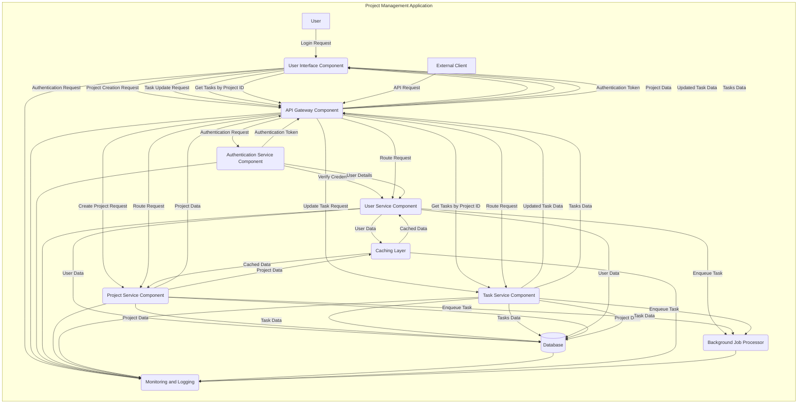

```markdown

```mermaid
```mermaid
graph LR
    subgraph "Project Management Application"
    
    %% Entities
    User[User]
    ExternalClient[External Client]
    
    %% Processes
    UI(User Interface Component)
    APIGW(API Gateway Component)
    AuthService(Authentication Service Component)
    UserService(User Service Component)
    ProjectService(Project Service Component)
    TaskService(Task Service Component)
    Cache(Caching Layer)
    JobProcessor(Background Job Processor)
    Monitoring(Monitoring and Logging)
    
    %% Data Stores
    Database[(Database)]
    
    %% Data Flows - User Interaction
    User -- "Login Request" --> UI
    UI -- "Authentication Request" --> APIGW
    APIGW -- "Authentication Request" --> AuthService
    AuthService -- "Verify Credentials" --> UserService
    UserService -- "User Data" --> Database
    AuthService -- "Authentication Token" --> APIGW
    APIGW -- "Authentication Token" --> UI
    UI -- "Project Creation Request" --> APIGW
    APIGW -- "Create Project Request" --> ProjectService
    ProjectService -- "Project Data" --> Database
    ProjectService -- "Project Data" --> APIGW
    APIGW -- "Project Data" --> UI
    UI -- "Task Update Request" --> APIGW
    APIGW -- "Update Task Request" --> TaskService
    TaskService -- "Task Data" --> Database
    TaskService -- "Updated Task Data" --> APIGW
    APIGW -- "Updated Task Data" --> UI
    UI -- "Get Tasks by Project ID" --> APIGW
    APIGW -- "Get Tasks by Project ID" --> TaskService
    TaskService -- "Tasks Data" --> Database
    TaskService -- "Tasks Data" --> APIGW
    APIGW -- "Tasks Data" --> UI

    %% Data Flows - External Client Interaction
    ExternalClient -- "API Request" --> APIGW
    APIGW -- "Route Request" --> UserService
    APIGW -- "Route Request" --> ProjectService
     APIGW -- "Route Request" --> TaskService
   
    %% Data Flows - Internal Service Communication and Data Storage
    AuthService -- "User Details" --> UserService
    UserService -- "User Data" --> Database
    ProjectService -- "Project Data" --> Database
    TaskService -- "Task Data" --> Database
    
    %% Data Flows - Additional Components
    UserService -- "User Data" --> Cache
    ProjectService -- "Project Data" --> Cache
    Cache -- "Cached Data" --> UserService
    Cache -- "Cached Data" --> ProjectService
    
    UserService -- "Enqueue Task" --> JobProcessor
    ProjectService -- "Enqueue Task" --> JobProcessor
    TaskService -- "Enqueue Task" --> JobProcessor
    
    UI --> Monitoring
    APIGW --> Monitoring
    AuthService --> Monitoring
    UserService --> Monitoring
    ProjectService --> Monitoring
    TaskService --> Monitoring
    Database --> Monitoring
    Cache --> Monitoring
    JobProcessor --> Monitoring
    
    end
```