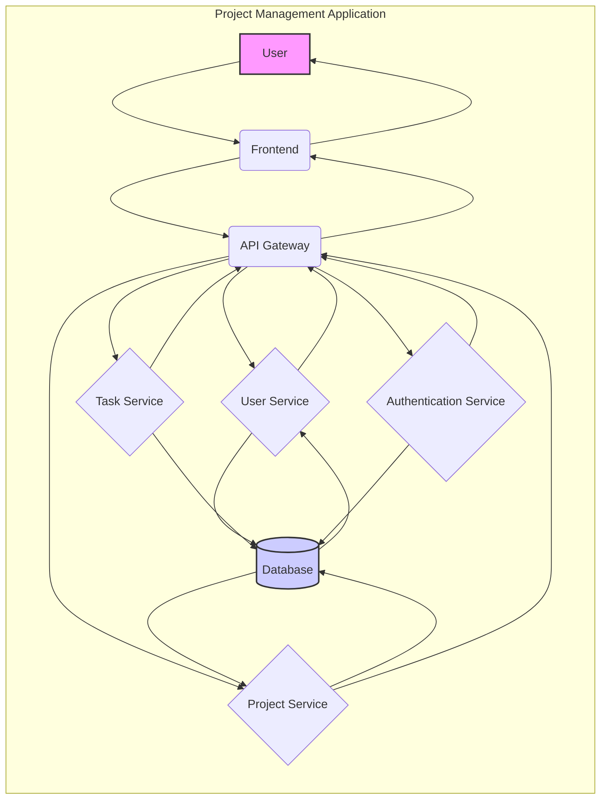

```markdown

```mermaid
```mermaid
graph LR
    subgraph "Project Management Application"
    A[User] --> B(Frontend);
    B --> C(API Gateway);
    C --> D{User Service};
    C --> E{Project Service};
    C --> F{Task Service};
    C --> G{Authentication Service};
    D --> H[(Database)];
    E --> H;
    F --> H;
    G --> H;
    H --> E;
    H --> D;
    E --> C;
    D --> C;
    F --> C;
    G --> C;
    C --> B;
    B --> A;
    end
    style A fill:#f9f,stroke:#333,stroke-width:2px
    style H fill:#ccf,stroke:#333,stroke-width:2px
```