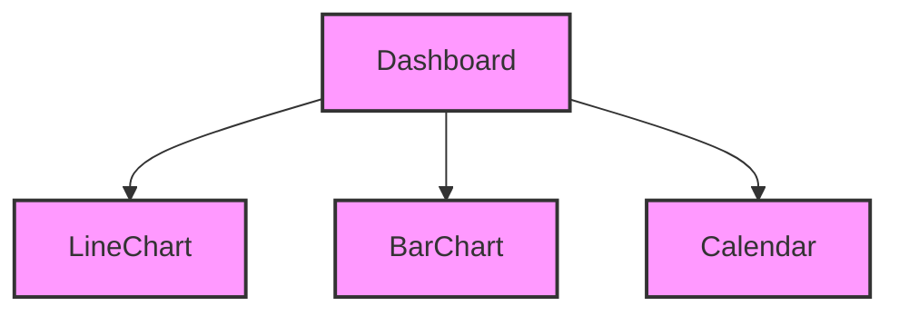

```markdown
# Component Architecture Report

This report summarizes the component architecture of the provided React code, highlighting key relationships and dependencies.

## Overview

The application consists of a main `Dashboard` component and several smaller chart components: `BarChart`, `LineChart`, and `Calendar`. The `Dashboard` orchestrates the layout and data flow, utilizing the chart components to display information.

## Component Diagram



## Component Details

### 1. Dashboard

*   **Purpose:** The main component responsible for the overall dashboard layout and data management.
*   **Dependencies:** `React`, `useState`, `LineChart`, `BarChart`, `Calendar`.
*   **State:** Manages the `moveGoal` and `plan` states, controlling form inputs and dynamic content.
*   **Functionality:**
    *   Fetches and prepares data for display in the chart components.
    *   Handles user interactions, such as changing the move goal and selecting a subscription plan.
    *   Renders the main dashboard structure, including revenue, subscription, calendar, move goal, exercise, payments and forms sections.
*   **Notes:** The Dashboard component serves as the parent component, responsible for composing and managing the other smaller components. It handles all data and passes this down as props to the children.

### 2. BarChart

*   **Purpose:** Renders a bar chart based on the provided data.
*   **Dependencies:** `React` (implicitly).
*   **Props:**
    *   `data`: An array of numbers representing the bar heights.
    *   `max`: An optional maximum value for scaling the bar heights (defaults to 500).
*   **Functionality:**
    *   Dynamically calculates bar heights based on the input data and maximum value.
    *   Renders a series of `div` elements styled as bars.
*   **Notes:** This is a presentation component, focused solely on rendering the bar chart visualization.

### 3. LineChart

*   **Purpose:** Renders a line chart based on the provided data points.
*   **Dependencies:** `React` (implicitly).
*   **Props:**
    *   `points`: An array of numbers representing the data points for the line.
    *   `color`: An optional color for the line (defaults to "#22223A").
*   **Functionality:**
    *   Calculates the coordinates for each point on the line based on the input data.
    *   Generates an SVG `polyline` element to render the line.
*   **Notes:** This is a presentation component, responsible for rendering the line chart visualization.

### 4. Calendar

*   **Purpose:** Renders a calendar for a given month and year, highlighting selected dates.
*   **Dependencies:** `React` (implicitly).
*   **Props:**
    *   `month`: The month to display (0-indexed).
    *   `year`: The year to display.
    *   `selected`: An array of numbers representing the selected days.
*   **Functionality:**
    *   Calculates the number of days in the month and the day of the week for the first day.
    *   Renders a grid of days, highlighting the selected dates.
*   **Notes:** This is a presentation component, responsible for rendering the calendar visualization.

## Key Relationships

*   The `Dashboard` component is the central hub, connecting all other components. It fetches and processes data, then passes it down to the child components for rendering.
*   The `BarChart`, `LineChart`, and `Calendar` components are independent presentation components, focusing solely on rendering visualizations based on the data they receive as props.
*   The application follows a unidirectional data flow, with data flowing from the `Dashboard` component down to the child components.

## Architecture Insights

*   **Component Reusability:** The `BarChart`, `LineChart`, and `Calendar` components are designed to be reusable, as they accept data as props and render visualizations accordingly.
*   **Separation of Concerns:** The code demonstrates separation of concerns, with the `Dashboard` component handling data management and the chart components handling rendering.
*   **Data Flow:** The application follows a clear unidirectional data flow, making it easier to understand and maintain.
*   **Scalability:** The component-based architecture makes the application more scalable, as new components can be easily added and integrated into the existing structure.
```