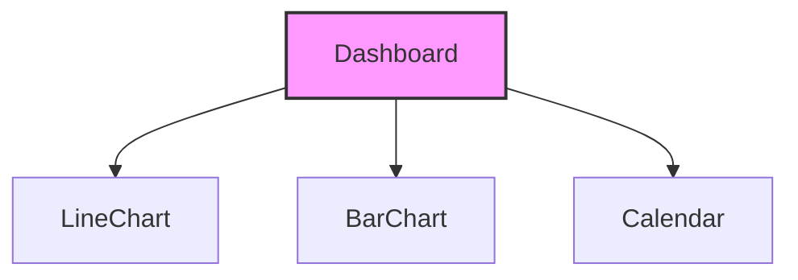

```markdown
# Component Architecture Report

This report summarizes the component architecture of the provided React code, highlighting key relationships and dependencies.

## 1. Component Overview

The codebase consists of four main components:

*   `Dashboard`: The main component, serving as the container for the entire dashboard. It manages state and orchestrates the rendering of other components.
*   `BarChart`: A component for rendering bar charts, used to visualize data such as move goals.
*   `LineChart`: A component for rendering line charts, used for visualizing trends in data like revenue and subscriptions.
*   `Calendar`: A component for displaying a calendar, allowing users to visualize dates.

## 2. Component Relationships

The following diagram illustrates the component relationships:



**Explanation:**

*   The `Dashboard` component is the parent component, importing and utilizing the `LineChart`, `BarChart`, and `Calendar` components.
*   The arrow indicates a "uses" relationship.  For example, `Dashboard --> LineChart` means `Dashboard` uses `LineChart`.
*   `LineChart`, `BarChart`, and `Calendar` are independent child components, responsible for rendering specific UI elements.

## 3. Component Details

### 3.1. Dashboard

*   **Role:**  The main container for the dashboard application. It fetches and manages data, controls the layout, and renders the child components.
*   **State:**
    *   `moveGoal`:  A number representing the user's daily move goal (in calories).
    *   `plan`: A string representing the user's subscription plan (e.g., "Starter", "Pro").
*   **Key Functionality:**
    *   Fetches and manages dashboard data (revenue, subscriptions, move data, exercise data, payments).  *Note: The data is currently hardcoded demo data.*
    *   Renders the layout of the dashboard, including charts, calendar, tables, and forms.
    *   Handles user interactions, such as updating the move goal and selecting a subscription plan.
*   **Dependencies:** `LineChart`, `BarChart`, `Calendar`, `React`
*   **Interactions:** The dashboard component allows the user to interact with the `moveGoal` state by incrementing and decrementing the goal amount. It also contains the logic to handle which `plan` is selected.

### 3.2. BarChart

*   **Role:** Renders a bar chart based on the provided data.
*   **Props:**
    *   `data`:  An array of numbers representing the data to be visualized.
    *   `max`: An optional number specifying the maximum value for the chart's y-axis.
*   **Key Functionality:**
    *   Dynamically generates the bars of the chart based on the `data` prop.
    *   Scales the height of the bars relative to the `max` prop.
*   **Dependencies:** `None`
*   **Interactions:** None

### 3.3. LineChart

*   **Role:** Renders a line chart based on the provided data points.
*   **Props:**
    *   `points`: An array of numbers representing the data points for the line chart.
    *   `color`: An optional string specifying the color of the line.
*   **Key Functionality:**
    *   Calculates the x and y coordinates for each data point.
    *   Generates the SVG path for the line chart.
*   **Dependencies:** `None`
*   **Interactions:** None

### 3.4. Calendar

*   **Role:** Renders a calendar for a given month and year.
*   **Props:**
    *   `month`:  A number representing the month (0-11).
    *   `year`:  A number representing the year.
    *   `selected`:  An array of numbers representing the days that should be highlighted as selected.
*   **Key Functionality:**
    *   Calculates the number of days in the specified month.
    *   Determines the day of the week for the first day of the month.
    *   Renders the calendar grid, highlighting the selected days.
*   **Dependencies:** `None`
*   **Interactions:** None

## 4. Architectural Insights

*   **Component-Based Architecture:** The code utilizes a component-based architecture, which promotes reusability and maintainability.  Each component encapsulates specific functionality and can be easily reused in other parts of the application.
*   **Data Flow:** Data flows from the `Dashboard` component down to the child components (`LineChart`, `BarChart`, `Calendar`).  The child components are responsible for rendering the data they receive as props.
*   **State Management:** The `Dashboard` component manages the application's state using the `useState` hook. This state is used to control the rendering of the dashboard and to handle user interactions.
*   **Presentation Logic:** The `BarChart`, `LineChart`, and `Calendar` components focus solely on presentation logic. They receive data as props and render it in a specific format.  They do not contain any business logic or data fetching logic.

## 5. Potential Improvements

*   **Data Fetching:** The dashboard currently uses hardcoded data.  In a real-world application, this data would be fetched from an API or database.
*   **State Management:** For more complex applications, a more robust state management solution like Redux or Context API could be used to manage the application's state.
*   **Component Reusability:** The `BarChart`, `LineChart`, and `Calendar` components could be further generalized to support different types of data and styling options, making them more reusable across different parts of the application.
```